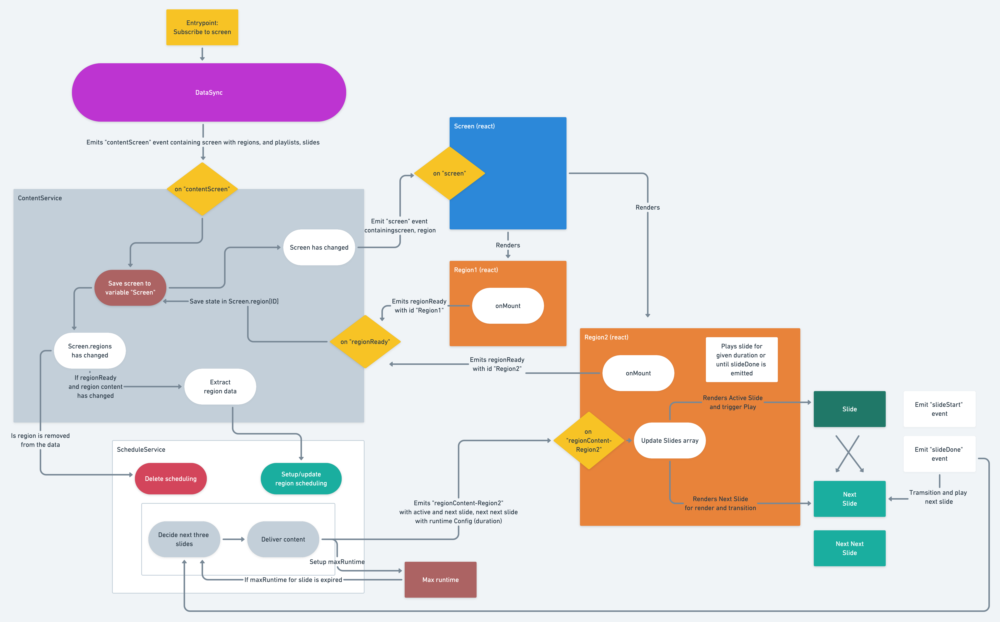

# DisplayClient

The display client for OS2Display ver. 2, currently a work in progress.

Currently, this is a create-react-app.

## Docker development setup

Get the api mock project

```
git clone https://github.com/os2display/display-api-mock.git json-server

# Install npm packages
docker-compose run json-server npm install
```

Start docker setup

```
# Install npm packages
docker-compose run node yarn install

# Up the containers
docker-compose up -d

# Follow the node logs to see when the code is compiled.
docker-compose logs -f node
```

The display client can opened at `http://display-client.local.itkdev.dk/`.

The code is compiled when changed.

The client can be configured by creating `public/config.json` with relevant values.
See `public/example_config.json` for values.

## Coding standards

For code analysis we use the [Airbnb style guide for javascript](https://github.com/airbnb/javascript) and for formatting we use [Prettier](https://github.com/prettier/prettier).

```
# Check for coding standards issues
docker-compose exec node bash -c 'yarn check-coding-standards'

# Auto-correct coding standards issues
docker-compose exec node bash -c 'yarn apply-coding-standards'
```

## Testing with cypress

We use [cypress](https://www.cypress.io/) for testing.

To run cypress tests in the cypress container:

```
docker-compose run cypress run
```

## Debug bar

The frontend has a debug bar, that allows for loading fixtures into the react app.
See the `public/fixtures` for the data fixtures.

## Build for production

Builds the app for production to the build folder.

@TODO: Add production build instructions.

## Event Model



## How to create a template (WIP - perhaps move this section to another place)

The templates are created with react ([remote component](https://github.com/Paciolan/remote-component)). The components that are loaded in the client should be compiled.
TODO: write more about remote component when implemented

### Obligatory

The client loads a compiled react component.
A component will be created like below

```html
<ExampleComponent
  slide="{slide}"
  slideDone="{slideDone}"
  content="{slide.content}"
  run="{run}"
/>
```

**slide**: The slide object.
**slideDone**: A function that is called when the slide is done.
**Content**: The slide content.
**Run**: A boolean that signals whether the slide is running or not.

The slide is responsible for signaling that it is done executing. This is done by calling the slideDone() function. If the slide should just run for X milliseconds then you can use the BaseSlideExecution class to handle this. See the example below.

```javascript
/**
 * Setup slide run function.
 */
const slideExecution = new BaseSlideExecution(slide, slideDone);
useEffect(() => {
  if (run) {
    slideExecution.start(slide.duration);
  } else {
    slideExecution.stop();
  }

  return function cleanup() {
    slideExecution.stop();
  };
}, [run]);
```

#### JSON for backend form

To populate the slide with data an admin form is needed. This is configured in a json file:

**input**: _input | header | image | select | checkbox_
**name**: A name, should be unique
**type**: text, number or email.
**label**: Label for the input
**helpText**: A helptext for the input
**required**: whether it is required data
**formGroupClasses**: For styling, bootstrap, e.g. mb-3
**options**: an array of options {name,id} for the select

The following example is for the image and text template:

```json
[
  {
    "input": "header",
    "text": "Skabelon: Tekst og billede",
    "name": "header",
    "formGroupClasses": "h4 mb-3"
  },
  {
    "input": "header-h3",
    "text": "Indhold",
    "name": "header",
    "formGroupClasses": "h5 mb-3"
  },
  {
    "input": "input",
    "name": "title",
    "type": "text",
    "label": "Overskrift",
    "helpText": "Her kan du skrive slidets overskrift",
    "required": true,
    "formGroupClasses": "col-md-6 mb-3"
  },
  {
    "input": "input",
    "name": "text",
    "type": "text",
    "label": "Tekst på slide",
    "helpText": "Her kan du skrive teksten til slidet",
    "formGroupClasses": "col-md-6"
  },
  {
    "input": "image",
    "name": "image",
    "label": "Billede"
  },
  {
    "input": "header-h3",
    "text": "Opsætning",
    "name": "header",
    "formGroupClasses": "h5 mb-3"
  },
  {
    "input": "input",
    "name": "duration",
    "type": "number",
    "label": "Varighed",
    "helpText": "Her skal du skrive varigheden på slidet",
    "required": true,
    "formGroupClasses": "col-md-6 mb-3"
  },
  {
    "input": "select",
    "required": true,
    "label": "Hvor skal tekstboksen være placeret",
    "formGroupClasses": "col-md-6 mb-3",
    "options": [
      {
        "name": "Toppen",
        "id": "top"
      },
      {
        "name": "Højre",
        "id": "right"
      },
      {
        "name": "Bunden",
        "id": "bottom"
      },
      {
        "name": "Venstre",
        "id": "left"
      }
    ],
    "name": "box-align"
  },
  {
    "input": "checkbox",
    "label": "Margin rundt om tekst",
    "name": "text-margin",
    "formGroupClasses": "col-lg-3 mb-3"
  },
  {
    "input": "checkbox",
    "label": "Animeret tekst under overskrift",
    "name": "seperator",
    "formGroupClasses": "col-lg-3 mb-3"
  },
  {
    "input": "checkbox",
    "label": "Teksten optager højest 50% af skærmen",
    "name": "half_size",
    "formGroupClasses": "col-lg-3 mb-3"
  },
  {
    "input": "checkbox",
    "label": "Overskriften er under teksten",
    "helpText": "Denne kan ikke kombineres med den animerede tekst under overskriften",
    "name": "reversed",
    "formGroupClasses": "col-lg-3"
  }
]
```

### Considerations

- Consider size of the screen the template will be displayed on (todo write about the scaling we do)
